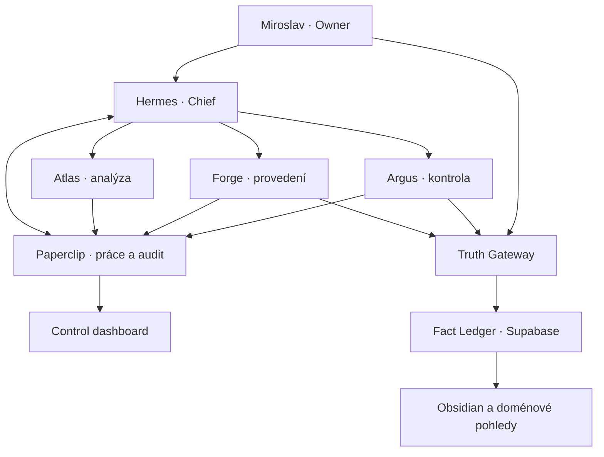

# MiLO / Hermes — řídicí systém života a práce

**Návrh funkčního MVP, agentní organizace, kontrolního dashboardu a zdroje pravdy**  
Verze: 1.0  
Stav návrhu: 2026-07-21, Europe/Prague  
Vlastník systému: Miroslav Brožek  
Hlavní agent: Hermes

---

## 0. Výsledek v jedné větě

MiLO má být jednoduchý provozní systém, v němž **Hermes přijme každý příkaz, před prací jej zaeviduje, přidělí jej jednomu vykonavateli a jinému kontrolorovi, ukáže skutečný živý průběh, nepovolí falešné „hotovo“ a oddělí řízení práce od append-only databáze ověřených faktů**.

Pro MVP se použije:

- **Hermes v0.19.0** jako jediný Chief agent komunikující s Miroslavem;
- **Paperclip v2026.720.0** jako hotový control plane pro projekty, tickety, běhy, heartbeat, audit, schvalování a náklady;
- **čtyři stálí agenti celkem**: Hermes, Atlas, Forge a Argus;
- **Truth Gateway** jako deterministický jediný zapisovatel do zdroje pravdy — není to pátý agent;
- **Supabase/Postgres** pro privátní append-only Fact Ledger a metadata důkazů;
- **Obsidian** jako čitelná projekce a pracovní archiv, nikoli autorita pro schválená fakta;
- **n8n a webhooky** pro deterministický sběr událostí a integrace;
- stávající **MiLO_Core** až ve druhé etapě jako tenká integrační a doménová vrstva, nikoli jako nový paralelní orchestrátor.

Nejdůležitější rozhodnutí je záměrně střídmé: **nebudovat před použitím další velký vlastní systém**. První cíl není dokončit „celé MiLO“, ale zprovoznit jeden úplný a ověřitelný tok práce.

---

## 1. Co lze a nelze poctivě garantovat

Požadavek na 100% plnění příkazů je správný jako provozní cíl, ale generativní model nemůže pravdivě garantovat 100% porozumění ani věcnou neomylnost. Systém proto přesouvá garance z paměti agenta do mechanických bran.

### Co lze vynutit deterministicky

Pokud příkaz vstoupí schválenou bránou, systém může vynutit, že:

1. každý příkaz dostane neměnné `command_id`, čas, kanál a doslovné znění;
2. před prvním pracovním krokem vznikne ticket;
3. vykonavatel a finální kontrolor stejné verze nejsou stejný agent;
4. všechny významné kroky, nástrojové akce, výstupy, chyby, náklady a změny stavů mají auditní událost;
5. stav `DONE` nevznikne bez výstupu, splněných kritérií a nezávislé kontroly;
6. riziková vnější akce neproběhne bez schválení Ownera;
7. schválený fakt nelze tiše změnit nebo smazat;
8. chyba nemůže skončit omluvou bez incidentu, vlastníka nápravy a regresního testu.

### Co nelze garantovat absolutně

- že model vždy pochopí záměr bez chyby;
- že internetový zdroj je pravdivý;
- že lidské schválení je věcně správné;
- že externí služba, API nebo síť bude dostupná;
- že předpověď budoucnosti nastane.

Odpovědí nejsou další prompty. Odpovědí jsou **kontrakty, důkazy, nezávislá kontrola, omezená oprávnění, schvalovací brány, audit a možnost návratu**.

---

## 2. Pracovní profil Miroslava

Tato část není psychologická diagnóza. Je to provozní profil odvozený z poskytnutého zadání a dřívějšího pracovního kontextu; má pomoci systému volit správnou formu podpory.

### 2.1 Role a rozsah agendy

Miroslav současně působí v několika odlišných režimech práce:

| Oblast | Typické činnosti | Potřebný výsledek systému |
|---|---|---|
| TJ Krupka a související kauza | vedení organizace, časová osa událostí, lidé a instituce, důkazy, podání, veřejná komunikace, sledování města | přesná znalostní báze, termíny, právně bezpečné texty, monitoring nových zdrojů |
| Sport a komunita | vedení klubu, trenérská a organizační agenda, schůzky, akce a závazky | přehled úkolů, kalendář, odpovědnosti, follow-up |
| WebDo24 a marketing | klientská práce, weby, reklamy, GA4, Ads, Search Console, reporting | výkon, náklady, změny kampaní, schvalování a měřitelné experimenty |
| MiLO / Hermes / automatizace | agenti, integrace, dashboard, workflow, datové modely, vývoj | stabilní minimum, jasná Definition of Done, zákaz nekonečného přestavování |
| Osobní administrativa | e-mail, kalendář, dokumenty, nápady, termíny a rozhodnutí | jediný inbox, prioritizace, připomínky, denní briefing |
| Strategie a komunikace | analýzy, vyjednávání, PR, předvídání reakcí protistran | oddělení faktu od hypotézy, varianty, rizika a profil výstupu podle publika |

### 2.2 Silné stránky, které má systém násobit

- vysoká energie, rychlé propojování souvislostí a tvorba nápadů;
- schopnost vidět dlouhodobou strategii a možné budoucí scénáře;
- široká praktická působnost: právo, komunita, sport, marketing i technologie;
- silný důraz na dohledatelnost, odpovědnost a reálný výsledek;
- ochota vytvářet kvalitní shrnutí a podklady.

### 2.3 Provozní rizika, která má systém kompenzovat

- rozsah řešení se snadno zvětší dříve, než vznikne použitelný výsledek;
- přibývají paralelní struktury, názvy, agenti a vrstvy, které se následně obtížně používají;
- dobré informace jsou rozdělené mezi mnoho shrnutí a míst;
- při zkracování kontextu se ztrácejí podmínky, detaily a dřívější dohody;
- fakta, výroky, obvinění, názory, emoce a právní hodnocení se mohou v pracovních textech smíchat;
- vývoj systému může začít spotřebovávat čas, který měl systém ušetřit;
- „rozpracováno“ se může tvářit jako pokrok, i když nevzniká použitelný výstup.

### 2.4 Co Miroslav od systému skutečně potřebuje

1. **Jedno místo pravdy o práci:** co běží, kdo to dělá, od kdy, proč, za kolik a jaký bude výstup.
2. **Jedno místo pravdy o faktech:** co je ověřeno, čím, kým, kdy a co je stále pouze tvrzení či hypotéza.
3. **Uzavírání smyček:** každý příkaz skončí výsledkem, blokací s důvodem, nebo vědomým zrušením — ne zmizením.
4. **Nízké vyrušování:** okamžitě jen kritické položky, ostatní dávkově.
5. **Důvěryhodnou kontrolu:** autor nikdy neprovádí finální kontrolu vlastní práce.
6. **Rychlé zachycení nápadu:** nápad se nezmění automaticky v prioritu, ale neztratí se.
7. **Jednoduchý provoz:** maximum čtyři stálí agenti a jeden kanonický workflow.

---

## 3. Jak vzniklo rozhodnutí

Návrh nevznikl pouze názorem hlavního zpracovatele. V souladu se zadáním byly nejprve vyžádány dva oddělené agentní posudky.

### 3.1 Posudek Chief agenta

Chief agent doporučil:

- přesně čtyři stálé agenty;
- Paperclip jako vyměnitelný control plane, nikoli zdroj pravdy;
- neměnný původní příkaz a atomické požadavky `REQ-*`;
- kontrolu jiným agentem a mechanickou bránu dokončení;
- append-only evidenci faktů, důkazní trezor a číslované snapshoty;
- incidentní postup místo omluvy bez nápravy;
- čtyři základní workflow: `ASK`, `DELIVER`, `ACTION`, `KNOWLEDGE`;
- současný vlastní dashboard rozšiřovat až po funkčním vertikálním řezu.

### 3.2 Posudek nezávislého analytického agenta

Analytický agent samostatně došel ke stejnému počtu čtyř rolí a doporučil navíc:

- používat Paperclip pouze pro projekty, úkoly, běhy, stavy, náklady, schvalování a audit;
- oddělit Truth Ledger od Paperclipu;
- deterministické sběrače řešit webhookem, cronem nebo n8n, nikoli dalším „přemýšlejícím“ agentem;
- Hermes profily izolovat a zápisy do paměti/skills podřídit schválení;
- zavést integrační „golden tests“, protože adaptér může ztratit instrukce, identitu, session nebo zkreslit náklady;
- omezit integrační pokus na jeden pracovní den a mít fallback přes přímé Hermes API/gateway + Paperclip webhooky;
- stará shrnutí považovat pouze za zdroj kandidátů, nikoli automaticky za pravdu.

### 3.3 Rozhodnutí

Oba posudky se shodly v jádru a doporučení se přijímá. Rozdíl mezi „agentem pro pravdu“ a „službou pro pravdu“ je rozhodnut ve prospěch služby: **Argus kontroluje význam, ale jediný zápis provádí Truth Gateway podle strukturovaného kontraktu**. Tím se nezavádí pátý stálý agent a jazykový model nemůže svévolně měnit schválená fakta.

---

## 4. Architektura bez zbytečné složitosti

### 4.1 Jasná autorita každé vrstvy

| Druh informace | Jediná autorita | Co je pouze projekce |
|---|---|---|
| projekty, tickety, přiřazení, stav práce | Paperclip | MiLO dashboard, briefing |
| běhy, heartbeat, živé logy, náklady, schválení | Paperclip + zdrojová provider telemetry | souhrny a grafy |
| původní příkaz | Command Ledger / audit Paperclipu | normalizovaný popis úkolu |
| důkazní originál | evidence vault s hashem | náhled, OCR, extrakt |
| schválené atomické informace | MiLO Fact Ledger | timeline, profily, shrnutí, podání |
| soubory a pracovní poznámky | jejich původní úložiště | odkazy v ticketu |
| pravidla a agentní instrukce | verzovaný repozitář | runtime context pack |

Zásada: **stejný stav se nesmí ručně udržovat ve dvou systémech**. MiLO dashboard zobrazuje Paperclip a Fact Ledger přes API; nevytváří vlastní konkurující stav.

### 4.2 Proč Paperclip ano

Paperclip již poskytuje většinu provozního podvozku: řízení projektů a úkolů, agentní běhy, heartbeat, audit, rozpočty, schvalování a API. To je přesně část, na které se není vhodné znovu zaseknout ve vývoji.

Použití je však podmíněné:

- verze je připnutá na `2026.720.0`;
- před autonomním provozem musí projít 12 P0 testy;
- experimentální funkce jako autonomní rozšiřování agentů, decision training, Cases, MCP Tool Gateway a automatický summarizer zůstávají v MVP vypnuté;
- záloha a návratová cesta jsou povinné;
- Paperclip není místem, kde se rozhoduje, co je fakt.

### 4.3 Proč ne Paperclip.ai jako všechno

Control plane optimalizovaný na práci není důkazní systém. Do Paperclipu patří „co má kdo udělat“ a „co se při tom stalo“. Nepatří tam kanonická právně citlivá tvrzení, hash-chain důkazů ani pravidla supersedování faktů.

### 4.4 Proč ne další agentní framework

CrewAI, LangGraph nebo další vlastní orchestrátor nejsou v MVP potřeba. Hermes již zajišťuje agentní runtime a Paperclip řídí práci. Další orchestrátor by vytvořil třetí stavový automat, další logy a další místo selhání.

---

## 5. Organizace agentů

### 5.1 Počet

**MVP má přesně čtyři stálé agenty.** Automatické zakládání dalších agentů je zakázáno. Právní, PR, reklamní, vývojová nebo finanční odlišnost se řeší verzovaným profilem práce a komunikačním profilem, ne dvaceti osobnostmi.

### 5.2 Role a odpovědnost

| Agent | Odpovídá za | Nesmí | Typický kontrolor |
|---|---|---|---|
| **Hermes — Chief** | příjem příkazů, triage, přiřazení, priority, termíny, rozpočty, briefing, eskalace a mechanické uzavření | nahrazovat specialistu, sám potvrdit věcnou správnost, tiše měnit zadání | Argus kontroluje procesní a materiální výstupy |
| **Atlas — Analyst** | internetový výzkum, teorie, strategie, diagnostika, scénáře, pre-mortem, předpovědi | měnit produkci, publikovat, vydávat hypotézu za fakt, schválit vlastní analýzu | Argus |
| **Forge — Executor** | dokumenty, kód, integrace, transformace dat, koncept komunikace a schválené akce | potvrdit vlastní `DONE`, zapisovat přímo do Fact Ledgeru, provádět rizikovou akci bez approval | Argus |
| **Argus — Auditor** | soulad se zadáním, fakta, identity, data, důkazy, právní citace, testy, chyby a Definition of Done | upravit výstup a sám jej schválit, přímo psát do Ledgeru, zahladit neshodu | Hermes ověřuje proces; Owner rozhoduje spory/rizika |

### 5.3 Neagentní části s odpovědností

| Komponenta | Úloha | Proč není agent |
|---|---|---|
| Truth Gateway | validuje kontrakt a append-only zapisuje | nesmí interpretovat ani improvizovat |
| n8n / webhook / cron | sběr Gmailu, kalendáře, webů a systémových událostí | deterministický přesun dat a trigger |
| runtime monitor | proces, PID, heartbeat, log stream, staleness | realita procesu se nemá odhadovat jazykovým modelem |

### 5.4 Povinný kontextový balíček každého běhu

Agent při startu nečerpá z vágní vzpomínky. Dostane explicitní a verzovaný balíček:

1. `constitution_version` a hash;
2. `agent_instruction_version` a hash;
3. doslovné znění příkazu;
4. seznam `REQ-*` a akceptačních kritérií;
5. projektový brief a povolené zdroje pravdy;
6. komunikační profil;
7. oprávnění, zakázané akce a approval gate;
8. relevantní fakta nebo jejich ID — ne náhodné celé shrnutí;
9. rozpočet, termín a plánovaný checkpoint;
10. ID ticketu, runu, firmy a profilu.

Na konci se stejný balíček použije pro postflight kontrolu. Tím se řeší ztráta pokynů při zkracování kontextu.

---

## 6. Čtyři kanonické pracovní workflow

### 6.1 `ASK` — otázka a rozhodnutí

1. Hermes zapíše otázku a rozhodnutí, které má odpověď podpořit.
2. Atlas provede analýzu a označí fakta, inference, hypotézy a neznámé.
3. Argus ověří materiální tvrzení a soulad s otázkou.
4. Hermes sdělí Ownerovi: kdo odpověděl, co řekl, co bylo ověřeno a co zůstává nejisté.

### 6.2 `DELIVER` — vytvoření výstupu

1. Hermes vytvoří brief, požadavky a Definition of Done.
2. Atlas případně připraví podklady/strategii.
3. Forge vytvoří dokument, kód, report nebo návrh.
4. Argus kontroluje původní zadání i výstup.
5. Hermes uzavře pouze mechanicky splněný ticket.

### 6.3 `ACTION` — změna ve vnějším světě

1. Nejprve vznikne návrh, diff nebo simulace.
2. Argus vyhodnotí riziko, fakta, publikum a vedlejší dopady.
3. Owner schválí rizikové odeslání, publikaci, finance, reklamu, právní podání nebo produkční nasazení.
4. Forge provede přesně schválenou akci.
5. Systém uloží potvrzení výsledku; záměr provést nestačí.

### 6.4 `KNOWLEDGE` — změna zdroje pravdy

1. Forge extrahuje kandidátní tvrzení a přesné lokace důkazů.
2. Argus kontroluje atomizaci, typ, identitu, datum, rozsah důkazu a rozpory.
3. Owner schválí zásadní/sporné položky ve sdruženém checklistu.
4. Truth Gateway validuje kontrakt a append-only zapíše.
5. Vznikne manifest, hash a nová projekce; původní historie zůstane.

---

## 7. Povinný životní cyklus úkolu

`INBOX → TRIAGE → READY → IN_PROGRESS → REVIEW → DONE`

Vedlejší pravdivé stavy: `WAITING_EXTERNAL`, `NEEDS_OWNER`, `BLOCKED`, `FAILED`, `CANCELLED`.

### 7.1 Povinná pole

Každý úkol obsahuje nejméně:

- datum a čas přijetí, vytvoření, startu, poslední události a konce;
- doslovné zadání a neměnné `command_id`;
- projekt, cíl, zadavatele a vstupní kanál;
- atomické požadavky `REQ-*`;
- akceptační kritéria a očekávaný výstup;
- vykonavatele a jiného kontrolora;
- stav, termín a zdroj termínu;
- riziko, komunikační profil a approval gate;
- rozpočtový limit a skutečné náklady;
- odkazy na výstupy, logy, review a incidenty;
- pokud není hotovo: pravdivý důvod, co chybí a kdo vlastní další krok;
- pokud je hotovo: odkaz na výstup, výsledek kontroly a čas dokončení.

### 7.2 Definition of Done

`DONE` je povolen pouze pokud současně:

- každý `REQ-*` má `MET` nebo explicitně schválené `WAIVED`;
- existuje ověřitelný výstup nebo dosažený externí výsledek;
- jiný agent vydal `PASS` nebo přípustný `PASS_WITH_NOTES`;
- nejsou otevřené P0/P1 rozpory bránící cíli;
- audit obsahuje start, konec, změny, náklady a kontrolu;
- proběhlo nutné schválení Ownera.

Agentovo sdělení „hotovo“ samo o sobě nemění stav.

### 7.3 Chyba není omluva

Při porušení požadavku vzniká incident:

- `incident_id`, čas a závažnost;
- jak se chyba projevila a jaký měla dopad;
- který `REQ-*` nebo pravidlo bylo porušeno;
- původní logy a související run/ticket;
- okamžitá mitigace;
- vlastník opravy a nápravný ticket;
- regresní test, který zabrání tichému opakování;
- stav `OPEN / INVESTIGATING / MITIGATED / DEFERRED / RESOLVED / ARCHIVED`.

V UI lze incident **vyřešit, odložit, připomenout, dále analyzovat nebo archivovat**. „Smazat“ z běžného pohledu znamená tombstone/archivaci; audit se nezničí. Skutečné zničení citlivých dat je zvláštní právně a bezpečnostně řízená operace.

---

## 8. Realtime monitoring znamená realitu

Agent není zelený proto, že existuje v konfiguraci nebo napsal „pracuji“. Stav je odvozen z procesu, runu a událostí.

### 8.1 Stavy agenta

| Stav | Mechanická podmínka | Co musí být vidět |
|---|---|---|
| `RUNNING` | živý run/proces a přibývají události | ticket, krok, start, poslední aktivita, další checkpoint |
| `IDLE_HEALTHY` | žádná přidělená práce ve stavu `READY/IN_PROGRESS` | od kdy je idle a zda čeká fronta |
| `STALLED` | má aktivní ticket, ale překročil povolené ticho | délka ticha, poslední událost, navržená reakce |
| `OFFLINE` | proces není živý nebo chybí očekávané heartbeat | poslední známý stav a restart/incident |
| `ERROR` | poslední run selhal | detail chyby a proklik na incident |
| `PAUSED` | ruční, bezpečnostní, approval nebo budget stop | kdo a proč zastavil, podmínka obnovení |

### 8.2 Výchozí provozní cíle MVP

Tyto hodnoty jsou konfigurovatelné a měří se; nejsou předstíranou garancí:

- událost aktivního runu se má v dashboardu objevit do 5 sekund (p95);
- aktivní run vysílá procesní heartbeat každých 30 sekund;
- `STALLED` vznikne po 180 sekundách bez významné aktivity, pokud ticket neurčí delší povolené ticho;
- `OFFLINE` vznikne po dvou zmeškaných heartbeat nebo potvrzeném zániku procesu;
- každý panel ukazuje `last_updated_at` a zdroj dat;
- plánovaný dlouhý krok musí předem uvést `expected_silence_until`, aby nebyl falešně zelený ani falešně červený.

### 8.3 Co se loguje

Povinné události:

`COMMAND_RECEIVED`, `TICKET_CREATED`, `ASSIGNED`, `RUN_STARTED`, `TOOL_STARTED`, `TOOL_FINISHED`, `CHECKPOINT`, `OUTPUT_CREATED`, `REVIEW_STARTED`, `REVIEW_COMPLETED`, `APPROVAL_REQUESTED`, `APPROVAL_DECIDED`, `STATUS_CHANGED`, `COST_RECORDED`, `INCIDENT_CREATED`, `RUN_FINISHED`.

Neukládá se skrytý interní řetězec uvažování modelu. Ukládají se ověřitelné vstupy, nástrojové akce, výstupy, stručné rozhodovací důvody, verze pravidel, hashe a časy. To dává audit bez předstírání přístupu k neveřejným myšlenkám modelu.

---

## 9. Kontrolní dashboard

První verze používá Paperclip UI jako provozní plochu. Vlastní MiLO dashboard přidává pouze pohledy, které Paperclip nemá, a vždy čte reálná API.

### 9.1 Stránky MVP

| Stránka | Hlavní otázka | MVP zdroj |
|---|---|---|
| **Control Room / Dnes** | Co je kritické, co dnes končí a co ode mě potřebuje rozhodnutí? | Paperclip dashboard + approvals + incidents |
| **Live Workflow** | Který agent právě skutečně pracuje, na čem, od kdy a s jakým posledním krokem? | runs, PID/process, event stream, heartbeat |
| **Projekty a úkoly** | Jaké jsou cíle, backlog, odpovědnosti, termíny a výstupy? | Paperclip projects/issues |
| **Agenti a běhy** | Kdo je running/idle/stalled/offline/error, jaká verze instrukcí běží a za kolik? | Paperclip agents/runs/costs |
| **Chyby a rozhodnutí** | Co se pokazilo nebo čeká na volbu? | incidents + approvals/attention queue |
| **Logy a audit** | Co přesně se stalo v daný čas a kdo změnu provedl? | Paperclip activity + MiLO audit |
| **Náklady** | Jaké jsou skutečné náklady podle projektu, agenta, modelu a runu? | provider usage + Paperclip costs |

### 9.2 Doménové stránky první navazující etapy

| Stránka | Obsah |
|---|---|
| **Pravda a důkazy** | Fact Ledger, kandidáti, rozpory, důkazy, snapshoty a schvalovací checklist |
| **Schůzky a závěry** | čas, účastníci, zdroj záznamu, rozhodnutí, úkoly a nevyřešené body |
| **Predikce** | scénář, horizont, předpoklady, indikátory, pravděpodobnostní pásmo a datum revize |
| **Integrace** | Gmail, kalendář, Drive, Sheets, GA4, Ads, Search Console, webové zdroje, poslední sync a chyba |
| **Projekt TJ Krupka** | timeline, lidé, instituce, skutky, tvrzení, důkazy, podání, termíny a rozpory |

### 9.3 Control Room na první pohled

Horní část obrazovky má pouze sedm prvků:

1. P0/P1 alarmy;
2. termíny do 72 hodin;
3. rozhodnutí čekající na Ownera;
4. živé agentní karty;
5. rozpracované prioritní tickety;
6. dokončené ověřené výsledky za posledních 24 hodin;
7. skutečné náklady dnes/měsíc a predikce proti limitu.

Každá karta ukazuje datum a čas poslední změny. Bez timestampu není stav důvěryhodný.

### 9.4 Live Workflow

Každá agentní karta obsahuje:

- jméno a roli;
- stav a barvu odvozenou z telemetry;
- aktuální ticket, projekt, cíl a krok;
- `started_at`, `last_event_at`, délku běhu a plánovaný checkpoint;
- poslední tři významné události;
- aktuální a kumulované náklady;
- blokaci nebo approval;
- proklik na živý log, výstupy, review a incident.

Pokud agent nepracuje, musí být zřejmé **proč**: nemá práci, čeká na externí vstup, čeká na Ownera, je pozastaven, stalled, offline nebo chybový. „Idle“ není chyba, pokud fronta neobsahuje přidělený připravený úkol.

### 9.5 Náklady a predikce

Skutečný náklad a odhad se nikdy nemíchají:

- `ACTUAL`: providerem vykázané tokeny/volání a pevné externí poplatky;
- `ESTIMATE`: výpočet s uvedeným modelem a předpoklady;
- `FORECAST`: budoucí scénář s horizontem a pásmem nejistoty.

Text „výrobek stojí $39“ se nesmí omylem započítat jako LLM náklad. Každý náklad má zdroj, měnu a `observed_at`.

---

## 10. Znalostní báze, která se rozšiřuje a nepřepisuje

### 10.1 Tři oddělené vrstvy

1. **Evidence Vault** — originální soubor/e-mail/zápis/webový snímek, původ, hash, čas získání a přístupová práva. Obsah se neupravuje.
2. **Fact Ledger** — atomické záznamy s typem, statusem, důkazem, review, approval a vztahy. Toto je jediný kanonický zdroj.
3. **Projekce** — timeline, profily osob, souhrny, právní podání, Facebook příspěvek, dashboard nebo Obsidian stránka. Projekce lze přegenerovat; nejsou pravdou samy o sobě.

### 10.2 Typ informace je jiná věc než stav ověření

| Typ | Význam |
|---|---|
| `VERIFIED_FACT` | doložitelná skutečnost v přesně vymezeném rozsahu |
| `DOCUMENTED_STATEMENT` | je prokázáno, že zdroj něco uvedl; nikoli nutně pravdivost obsahu |
| `ALLEGATION` | obvinění nebo tvrzení o pochybení bez konečného potvrzení |
| `OPINION` | hodnotící soud |
| `EMOTION` | subjektivní prožitek nebo jeho sdělení |
| `LEGAL_ASSESSMENT` | právní hodnocení či kvalifikace |
| `HYPOTHESIS` | vysvětlení nebo motiv k ověření |
| `DECISION` | kdo, kdy a v jakém rozsahu rozhodl |
| `FORECAST` | budoucí scénář s předpoklady a horizontem |
| `UNKNOWN` | dosud neurčený typ |

Samostatný stav je: `PROPOSED`, `VERIFIED`, `APPROVED`, `DISPUTED`, `SUPERSEDED`, `WITHDRAWN`.

Příklad: věta může být typu `ALLEGATION` a současně ve stavu `APPROVED`, protože je bezpečně ověřeno a schváleno, že konkrétní osoba dané obvinění v konkrétní den vyslovila. To z obsahu obvinění nedělá fakt.

### 10.3 Úrovně zralosti L0–L6

| Úroveň | Obsah | Lze použít jako fakt? |
|---|---|---|
| L0 — Intake | nezpracovaný soubor, zpráva nebo staré shrnutí | ne |
| L1 — Extracted | strojově vytěžené kandidátní věty | ne |
| L2 — Classified | atomizované a typované kandidáty | ne |
| L3 — Evidence-linked | přesná lokace a hash důkazu | pouze pro kontrolu |
| L4 — Independently verified | Argus ověřil identitu, datum, rozsah a klasifikaci | ano v interním rozsahu, dle pravidel projektu |
| L5 — Owner approved / sealed | položka je v číslovaném baseline snapshotu | ano jako prioritní projektové datum |
| L6 — Authoritative decision | pravomocné rozhodnutí nebo autoritativní zdroj, s přesným rozsahem | ano, ale jen v rozsahu rozhodnutí |

### 10.4 Svaté jádro a změna ve vlnách

Po schválení je jádro události `čas + lidé + organizace + děj + objekt` neměnné. Nová informace se přidá jako další záznam. Oprava vytvoří záznam `CORRECTS` nebo `SUPERSEDES`; původní záznam zůstane dohledatelný.

Každá vlna vytvoří:

- seznam zahrnutých záznamů;
- seznam odmítnutých/sporných kandidátů;
- hashe důkazů a záznamů;
- kdo vytěžil, kdo kontroloval a kdo schválil;
- čas uzavření a verzi pravidel;
- lidsky čitelný snapshot, např. `TJ-KRUPKA-BASELINE-0001`.

### 10.5 První vlny pro TJ Krupka

Rozšiřování má být postupné:

1. **Instituce a identity:** jednoznačná ID, alternativní názvy, role a období platnosti.
2. **Hlavní aktéři:** osoby, vztahy, funkce a časové intervaly — bez přisuzování motivů jako faktů.
3. **Klíčové dokumenty:** původ, datum, typ, hash, autor, adresát a přístup.
4. **Základní timeline:** jen události s ověřeným jádrem.
5. **Tvrzení, obvinění a rozhodnutí:** vždy s mluvčím/rozhodujícím orgánem a přesným důkazem.
6. **Rozpory a otevřené otázky:** bez nuceného „vyřešení“ odhadem.
7. **Právní hodnocení a scénáře:** navázané na fakta, ale jasně oddělené.

### 10.6 Jak použít stará shrnutí

Použít je, ale **nikoli jako autoritu**. Každé shrnutí se eviduje jako L0 se zdrojem a hashem. Forge z něj vytěží atomické kandidáty, které se deduplikují a porovnají s důkazy. Dobré části se zachrání; drobná nepřesnost se dál nerozmnožuje.

### 10.7 Nesrovnalosti bez neustálého rušení

Každý rozpor dostane ID, závažnost, záznamy/důkazy v konfliktu, detekci, vlastníka a navrženou otázku. Režim eskalace:

- P0 okamžitě;
- P1 v denním briefingu;
- P2 každé dva dny jako odškrtávací checklist;
- P3 týdně.

Odpověď Ownera se okamžitě uloží jako rozhodnutí, spustí potřebnou kontrolu a případně vytvoří nový append-only záznam. Neprovádí tichou editaci starého snapshotu.

---

## 11. Komunikace podle publika a cíle

Stejná fakta mohou mít odlišnou formu, ale nesmí mít odlišnou pravdivost. Před každým textem vznikne **Communication Brief**:

- komu komunikujeme;
- čeho chceme dosáhnout a jaká reakce je žádoucí;
- kanál a délka;
- která fakta jsou povolena;
- která tvrzení, nejistoty nebo citlivé údaje je nutné označit/omezit;
- tón;
- hlavní riziko selhání;
- call to action;
- schvalovací brána.

### 11.1 Schválené profily MVP

| Profil | Primární účel | Povinná kontrola |
|---|---|---|
| `INTERNAL_ANALYSIS` | hloubka, varianty a rozhodnutí | Argus podle materiálnosti |
| `EXECUTIVE_BRIEF` | rychlý Ownerův přehled | Argus pro P0/P1, právní a finanční obsah |
| `LEGAL_FILING` | procesně přesné právní sdělení | Argus + odborná právní kontrola dle rizika + Owner |
| `PUBLIC_SOCIAL` | srozumitelnost a důvěryhodná reakce veřejnosti | Argus + Owner před publikací |
| `NEGOTIATION_EMAIL` | konkrétní výsledek bez nechtěného závazku | Argus + Owner před odesláním |
| `ADS_CHANGE` | měřitelný marketingový experiment | Argus + Owner před změnou rozpočtu/spuštěním |

### 11.2 Facebook vs. trestní oznámení

Facebookový příspěvek optimalizuje srozumitelnost, důvěryhodnost a konkrétní reakci; musí být krátký a nesmí právně riskantně zjednodušit neověřené obvinění. Trestní oznámení optimalizuje přesnost, časovou posloupnost, rozsah dokazování a procesní použitelnost; každé tvrzení musí být kvalifikováno a propojeno s důkazem. Oba výstupy vycházejí ze stejného Fact Ledgeru, ale používají jiný profil a jinou kontrolní matici.

---

## 12. Integrace a sběr dat

### 12.1 Princip

Konektory data pouze získají, zaevidují a vytvoří kandidáty nebo tickety. Samotný příjem e-mailu, zápisu města či metriky reklamy z něj nedělá schválený fakt ani pokyn k vnější akci.

### 12.2 Pořadí připojování

1. Hermes vstup + Paperclip ticket;
2. kalendář a deadline monitor;
3. Gmail a Drive jako read-only intake;
4. webový monitoring města Krupka a nových zápisů;
5. Sheets, GA4, Ads a Search Console jako read-only metriky;
6. teprve po stabilitě řízené zápisové akce;
7. WhatsApp až po vyřešení spolehlivého a právně přípustného konektoru/exportu.

### 12.3 Automatický webový monitoring TJ Krupka

Deterministický plánovaný job:

1. uloží URL, čas kontroly, HTTP metadata a hash obsahu;
2. zjistí změnu proti poslednímu hashi;
3. uloží originál/snímek jako evidenci;
4. vytvoří ticket a kandidátní extrakty;
5. Atlas vyhodnotí relevanci a Forge atomizuje;
6. Argus ověří, zda zdroj skutečně podporuje tvrzení;
7. Truth Gateway zapíše až po splnění brány;
8. Hermes zahrne změnu do briefingu podle priority.

Pouhé „AI našla novinku“ není schválená informace.

### 12.4 Přístupová práva

- výchozí režim konektorů je read-only;
- každá služba má vlastní minimální credentials;
- service role/owner klíč není dostupný agentům;
- tajné údaje se neobjevují v promptu ani logu;
- produkční zápisy, publikace a finanční změny mají explicitní approval;
- interní databázové schéma Fact Ledgeru není přímo vystavené klientovi; přístup jde přes API/Truth Gateway.

---

## 13. Okamžité MVP — přesný rozsah

### 13.1 Jediný vertikální řez

MVP je funkční tehdy, když projde tento scénář:

> Miroslav zadá Hermesovi netriviální úkol → před prací vznikne ticket → Hermes určí Forge/Atlas a Argus → v Live Workflow je vidět skutečný run → vznikne výstup → Argus jej ověří proti původnímu zadání → případná chyba má incident → náklady a logy jsou dohledatelné → `DONE` je možné pouze s důkazy.

### 13.2 Co je v MVP

- připnutý Paperclip a Hermes;
- čtyři agentní profily a Ústava;
- projekty, tickety, runy, heartbeat, logy, náklady, approvals a incidents;
- povinný Task Contract a Incident Contract;
- živé stavy odvozené z procesu;
- denní briefing a dvoudenní checklist rozporů;
- jeden testovací projekt a jeden reálný nízkorizikový úkol;
- po úspěchu první znalostní vlna TJ Krupka: identity + 10–20 nejjistějších atomických záznamů;
- čitelný snapshot s manifestem.

### 13.3 Co záměrně není v MVP

- vlastní nový vizuální orchestrátor;
- automatické zakládání agentů;
- autonomní právní podání nebo veřejná komunikace;
- plná migrace všech starých shrnutí;
- vlastní náhrada Paperclip ticketingu;
- složitý knowledge graph před ověřenou timeline;
- automatické změny reklamních rozpočtů;
- experimentální Paperclip funkce;
- perfektní predikční engine;
- kompletní integrace všech kanálů v jednom kroku.

### 13.4 Implementační pořadí

1. **Záloha:** zazálohovat stávající Hermes workspace, konfiguraci, skills, memory, sessions a MiLO databázi; ověřit obnovu.
2. **Izolace:** Paperclip spustit samostatně na loopbacku; nezasahovat do rootu `MiLO_Core`.
3. **Připnutí:** Paperclip `2026.720.0`, Hermes `0.19.0`; žádné automatické upgrady.
4. **Konfigurace:** vložit Ústavu, Hermes, Atlas, Forge, Argus a komunikační profily.
5. **Golden tests:** projít P0 testy; jediný fail blokuje autonomní heartbeat.
6. **Vertikální řez:** provést jeden nízkorizikový reálný úkol od příkazu po review.
7. **Truth slice:** zprovoznit kandidát → Argus → Owner → Gateway → snapshot.
8. **TJ Krupka:** první malá baseline vlna.
9. **Integrace:** kalendář, Gmail/Drive read-only, web města; pak marketingová data.
10. **Vlastní MiLO pohledy:** teprve pokud Paperclip UI nestačí pro konkrétní doménovou otázku.

### 13.5 Stop pravidlo proti překombinování

Každý nový agent, databáze, framework, dashboard stránka nebo typ objektu musí splnit všechny podmínky:

- řeší doložený provozní problém z alespoň tří opakování;
- existující nástroj jej neumí přijatelné řešit;
- má vlastníka, metriku úspěchu a test;
- nezavádí druhý zdroj stejné pravdy;
- lze jej odstranit nebo vrátit;
- Owner schválil náklady a složitost.

Jinak jde do `IDEAS`, ne do aktivního vývoje.

---

## 14. Akceptační brána

Autonomní provoz nesmí začít, dokud neprojdou všechny P0 testy:

1. zdraví API a databáze;
2. prokazatelné vložení aktuálních instrukcí a Ústavy;
3. správná identita agent/company/run/ticket bez úniku tajemství;
4. ticket před prvním pracovním krokem;
5. živý proces a log, po killu chyba místo zeleného stavu;
6. zákaz falešného `DONE`;
7. odlišný vykonavatel a kontrolor;
8. integrita nákladů;
9. obnova session bez záměny kontextu;
10. úplný audit;
11. funkční approval gate;
12. ověřená záloha a restore.

Před znalostní bází navíc:

- přímá editace schváleného záznamu je odmítnuta;
- neznámé datum se nedoplní odhadem;
- osoby stejného jména se nesloučí;
- doložený výrok se nezmění na ověřený fakt;
- rozpor vytvoří položku checklistu;
- Ownerova odpověď vytvoří auditované rozhodnutí a novou projekci.

---

## 15. Pre-mortem: jak se to může pokazit

| Selhání | Časný signál | Prevence | Návrat |
|---|---|---|---|
| Znovu se začne stavět velký dashboard | přibývají stránky, ale vertikální řez neprošel | freeze rozsahu, jedna metrika: ověřeně uzavřený úkol | zahodit projekční UI, vrátit se k Paperclipu |
| Paperclip × Hermes ztratí instrukce/identitu/session | agent nezná ticket, Ústavu nebo pokračuje v cizím kontextu | P0 golden tests, připnuté verze, context hash | vypnout autonomní heartbeat; přímé Hermes API + webhooky |
| Monitoring ukazuje zelenou bez práce | nemění se `last_event_at`, ale stav zůstává running | stav od procesu, heartbeat a staleness | automatický incident + restart/ruční režim |
| Agent zapomene část příkazu | chybí `REQ-*` nebo výstup řeší jen shrnutí | neměnný originál, preflight/postflight matrix | vrátit do `IN_PROGRESS`, incident a regresní test |
| Autor schválí vlastní práci | reviewer ID = executor ID nebo kontrolor upravuje výstup | databázová/service constraint | odmítnout transition, přiřadit jiného kontrolora |
| Stará shrnutí kontaminují fakta | shrnutí se cituje bez přesné evidence | všechna jako L0 kandidáti | zneplatnit projekci, Ledger zůstane čistý |
| Fakt se tiše změní | zmizí původní hodnota nebo hash nesedí | append-only + hash-chain + no UPDATE/DELETE | obnovit projekci z kanonického proudu |
| Owner je zahlcen maličkostmi | časté notifikace P2/P3 | P0 okamžitě, ostatní dávkově | digest režim a přenastavení závažnosti |
| Agent provede riskantní vnější akci | chybí approval ID | minimální scopes, dry-run, approval gate | revoke credentials, incident, případná kompenzace |
| Náklady utečou | běhy bez limitu, retry loop, nejasná měna | hard budget, retry limit, actual/estimate odděleně | kill run, pause agent, denní cost review |
| Dva systémy mají jiný stav úkolu | Paperclip `DONE`, MiLO `IN_PROGRESS` | jediná autorita a external ID | přegenerovat projekci z Paperclipu |
| „Dočasné“ výjimky rozloží pravidla | mnoho ručních oprav bez decision logu | verze, diff, expirace výjimky | rollback pravidel a audit výjimek |

---

## 16. Provozní rytmus

### Každý příkaz

Ticket → přiřazení → live run → výstup → nezávislá kontrola → doložené uzavření.

### Každý den v 08:30 Europe/Prague

Hermesův briefing:

1. P0/P1 události;
2. dnešní termíny a termíny do 72 hodin;
3. aktivní práce a stalled/offline agenti;
4. blokace a rozhodnutí Ownera;
5. ověřené výsledky za posledních 24 hodin;
6. skutečné náklady a odchylky;
7. sedmidenní forecast s předpoklady.

### Každé dva dny

Jeden odškrtávací seznam nesrovnalostí a rozhodnutí. Každá odpověď je hned navázána na ticket/record a audit.

### Každý týden

- přehled projektů a kapacity;
- opakované incidenty a účinnost regresních testů;
- náklady proti dosaženým výsledkům;
- accuracy minulých forecastů;
- návrhy zlepšení — bez automatické změny pravidel.

### Každá změna systému

Ticket → důvod → diff → test → kontrola → approval dle rizika → nasazení → čas/verze → rollback plán.

---

## 17. Metriky, které měří posun, ne aktivitu

| Metrika | Smysl | První cílová hranice |
|---|---|---|
| Intake coverage | kolik přijatých netriviálních příkazů dostalo ticket | 100 % přes schválenou bránu |
| Verified completion rate | podíl uzavřených úkolů s výstupem a review | 100 % `DONE` |
| Silent work incidents | práce bez ticketu/logu | 0 |
| False green incidents | dashboard tvrdil running/healthy proti procesu | 0 |
| Reopen rate | úkol znovu otevřen kvůli nesplněnému zadání | sledovat trend dolů |
| Median cycle time | přijetí → ověřený výsledek podle typu práce | baseline první 2 týdny |
| Owner interruption load | počet jednotlivých nekritických vyrušení | směřovat k digestu |
| Fact provenance coverage | schválené záznamy s přesnou evidencí a hashem | 100 % |
| Forecast calibration | zda se scénáře v deklarovaných pásmech naplňují | měřit po horizontu |
| Outcome per cost | ověřené výsledky vůči reálným nákladům | po projektu a měsíci |

Není cílem maximalizovat počet agentních kroků, tokenů ani ticketů. Cílem je zkrátit cestu od záměru k ověřenému výsledku.

---

## 18. První konkrétní provozní rozhodnutí

1. **Hlavní agent:** Hermes.
2. **Počet stálých agentů:** 4.
3. **Control plane:** Paperclip `2026.720.0`, samostatná instance.
4. **Runtime:** Hermes `0.19.0` až po záloze a integračních testech.
5. **Zdroj pravdy o práci:** Paperclip.
6. **Zdroj pravdy o faktech:** privátní Supabase/Postgres Fact Ledger přes Truth Gateway.
7. **Důkazy:** originály v jejich trezoru/úložišti; Ledger nese metadata, locator a SHA-256, citlivý obsah se zbytečně nekopíruje.
8. **Obsidian:** čitelná, znovu generovatelná projekce.
9. **MVP projekt:** systémový vertikální řez; potom TJ Krupka baseline wave 0001.
10. **Notifikace:** P0 okamžitě, P1 denně, P2 obden, P3 týdně.
11. **Vnější akce:** návrh je automatizovatelný; odeslání/publikace/finance podle approval matice.
12. **Upgrade:** nikdy automaticky; vždy ticket, záloha, test, rozhodnutí a rollback.

---

## 19. Co je připraveno v přiloženém MVP balíčku

- `constitution/CONSTITUTION.md` — neměnná provozní pravidla v1.0;
- `agents/` — přesné instrukce čtyř stálých agentů;
- `operations/WORK_PROTOCOL.md` — životní cyklus úkolu a notifikace;
- `communication/PROFILES.yaml` — profily pro interní, právní, veřejnou, vyjednávací a reklamní komunikaci;
- `knowledge/TRUTH_PROTOCOL.md` — taxonomie a vlnový postup znalostní báze;
- `knowledge/TRUTH_GATEWAY.md` — jediný řízený zápis;
- `contracts/*.schema.json` — strojově validovatelné kontrakty úkolu, faktu a incidentu;
- `paperclip/SETUP.md` — bezpečný start;
- `paperclip/ACCEPTANCE_TESTS.md` — produkční brána.

Balíček neobsahuje přístupové údaje a sám neprovádí žádnou vnější akci.

---

## 20. Zdroje a ověření nástrojů

Ověřeno dne 2026-07-21:

- Paperclip, oficiální repozitář a popis control plane: <https://github.com/paperclipai/paperclip>
- Paperclip release `v2026.720.0` ze dne 2026-07-20: <https://github.com/paperclipai/paperclip/releases/tag/v2026.720.0>
- Paperclip REST API a OpenAPI: <https://docs.paperclip.ing/reference/api/overview/>
- Hermes Agent, oficiální releases: <https://github.com/NousResearch/hermes-agent/releases>
- Hermes memory: limity souborů, načtení při startu session a approval pro zápis: <https://hermes-agent.nousresearch.com/docs/user-guide/features/memory>
- Hermes profiles a jejich izolační hranice: <https://hermes-agent.nousresearch.com/docs/user-guide/profiles>
- Event Sourcing pattern pro append-only historii a projekce: <https://learn.microsoft.com/en-us/azure/architecture/patterns/event-sourcing>
- W3C PROV-O pro provenienci entit, aktivit a agentů: <https://www.w3.org/TR/prov-o/>
- Supabase zabezpečení Data API, RLS a privátních schémat: <https://supabase.com/docs/guides/database/hardening-data-api>

---

## 21. Závěr

MiLO se neposune vpřed tím, že dostane více agentů, více kódu nebo více vrstev paměti. Posune se tím, že každá práce projde jedním viditelným tokem a každé tvrzení jednou kontrolovanou cestou k pravdě.

První praktický úspěch proto zní:

> **Jeden reálný příkaz, jeden automaticky evidovaný ticket, jeden viditelný běh, jeden skutečný výstup, jeden jiný kontrolor a žádné „hotovo“ bez důkazu.**

Po průchodu tohoto řezu lze bezpečně a postupně rozšiřovat TJ Krupka, marketing, e-mail, kalendář, projekty i vlastní MiLO dashboard bez návratu k chaosu.
